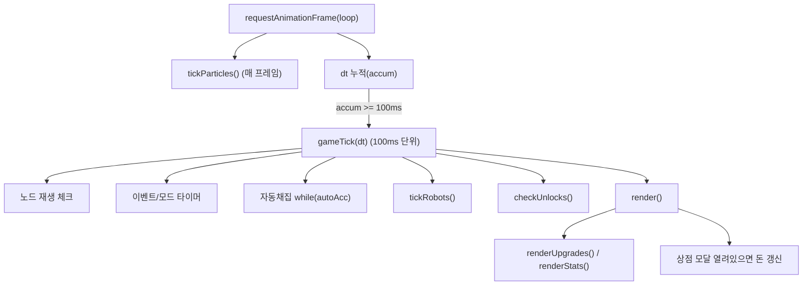

# 해초농장_v8.5.html 심층 분석 (선(先)분석 → 후(後)코딩)
> 작성일: 2026-04-26  
> 대상 파일(프로젝트 기준본): `C:\Users\User\Documents\New project\games\해초농장_v8.5.html`  
> 목적: 코딩(수정/추가) 전에 **구조·역할·흐름·데이터 계약**을 완전히 파악해 “파일의 진짜 주인”이 되기.

---

## 0) TL;DR (초보자용 10줄 요약)
1. 이 게임은 **단일 HTML 파일** 안에 UI(CSS/HTML)와 로직(JS)이 전부 들어있다.  
2. 게임의 모든 상태(돈, 인벤, 업그레이드 등)는 `S`라는 **상태 객체(게임 메모장)** 하나에 모인다.  
3. 화면은 `render()`가 `S`를 읽어서 **DOM(화면 요소)** 를 업데이트한다.  
4. 게임은 `requestAnimationFrame(loop)`로 계속 돌며, 100ms마다 `gameTick(dt)`로 로직을 처리한다.  
5. 해초 노드는 `S.nodes[]`로 관리되고, 채집하면 `respawnAt`(재생 시간)이 설정된다.  
6. 자동채집은 `S.autoAcc`(누적 시간)을 쌓아 `while`로 “밀린 채집”을 처리한다.  
7. 이벤트는 “화난 해초(격전)”와 “산소(O₂) 이벤트”가 있고, 동시에 겹치지 않게 설계돼 있다.  
8. 유물은 드랍되며, 중복이면 포인트를 받고 포인트로 유물을 업그레이드한다.  
9. 저장은 브라우저 `localStorage`(브라우저에 저장되는 작은 메모장)에 10초마다 자동 저장된다.  
10. 앞으로 수정은 무조건: **분석 문서 갱신 → 플랜 → 승인 → 실행** 순서로 한다.

---

## 1) 파일 메타(기본 속성)
- 파일 크기: `1,140,616 bytes` (약 1.14MB)
- 줄 수: `1617 lines` (LF 기준)
- `<script>` 시작 라인: `795`
- `<title>`: `🌿 해초 농장`
- 저장 키(localStorage key): `swfarm_v81` *(파일명 v8.5지만 키는 v81로 보임 — 개선 후보로 기록)*
- 외부 의존성:
  - Google Fonts 2종 로드: `Press Start 2P`, `DotGothic16`
  - 그 외 라이브러리 없음(순수 HTML/CSS/JS)
- BGM:
  - `<audio id="bgm">`에 **base64(문자열로 인코딩된 음원 데이터)** 가 매우 크게 포함됨(파일 용량의 대부분)

---

## 2) 코드 지도(어디에 뭐가 있나)

### 2.1 최상위 구조
- `HEAD`
  - `<style>`: 전체 UI/레이아웃/애니메이션/반응형(모바일) 정의
- `BODY`
  - 고정 UI(상단바/메인 패널/모달/오버레이/토스트/배너/오디오)
- `SCRIPT`(라인 `795~1617`)
  - 게임 로직 전체(상태/데이터/루프/렌더/저장/이벤트)

### 2.2 JS 섹션 맵(핵심 라인 앵커)
> 아래 라인 번호는 `games\해초농장_v8.5.html` 기준.

| 섹션 | 시작 라인 | 역할 |
|---|---:|---|
| AUDIO | 798 | 효과음(SFX) 생성(WebAudio), BGM 재생, 설정 패널 |
| MOBILE TAB SYSTEM | 831 | 모바일(≤640px) 탭 전환 로직 |
| CONSTANTS | 915 | 등급/확률/업그레이드/유물/이벤트 상수·테이블 |
| STATE | 984 | 상태 객체 `S` 정의 + 렌더 캐시(PV) |
| ROBOTS | 1070 | 로봇 DOM/이동/GPU transform 기반 애니메이션 |
| RELIC SYSTEM | 1113 | 유물 드랍/팝업/포인트/업그레이드/렌더 |
| DOM INIT | 1192 | 초기 DOM 생성(인벤/상점/노드/스탯/캔버스/모바일) |
| GAME ACTIONS | 1284 | 클릭(채집/판매/업글/이벤트)로 상태 변경 |
| MAIN LOOP | 1403 | 루프 + `gameTick(dt)` (100ms 단위) |
| RENDER | 1455 | 화면 업데이트(변경분 최소화) |
| SAVE / LOAD | 1534 | localStorage 저장/불러오기/초기화 |
| START | 1608 | `loadGame()` → `initDOM()` → 루프/자동저장 시작 |

---

## 3) UI 레이아웃 맵(HTML 구조)

### 3.1 큰 레이아웃(데스크톱 기준)
대략 이런 3단 구조(좌/중/우)로 생각하면 된다.

```
상단바(#topbar): 돈/총채집/DPS/총수익 + 모드 배너 + 설정
└─ 메인(#main)
   ├─ 좌측(#left): 인벤토리/판매
   ├─ 중앙(#farm): 노드(#nodes-grid) + 로봇 + 이벤트 오버레이
   └─ 우측(#right): 로봇패널 + 상점(사이드) + 스탯 + 유물
```

### 3.2 핵심 UI 요소(고정 DOM)
- 상단바:
  - `h-money`, `h-total`, `h-dps`, `h-earned` (핵심 수치 표시)
  - 모드 배너: `tb-fresh`/`fresh-t`, `tb-wilt`/`wilt-t`, `tb-osat`/`osat-t`
  - 화난 해초 쿨타임: `tb-acd`/`acd-t`
  - 설정: `tb-settings` + `settings-panel`(볼륨 슬라이더)
- 중앙 팜:
  - `farm` 내부에 `nodes-grid`(채집 노드들이 동적 생성됨)
  - 로봇 컨테이너: `robots-container`
  - 이벤트 오버레이:
    - 화난 해초: `angry-ov`
    - 산소 이벤트: `oxy-ov` + HUD `oxy-hud`
- 우측 패널:
  - 로봇 패널: `rb-panel`, 자동채집 바 `auto-bar`/`auto-pg`/`auto-cd`, 로봇 썸네일 `rb-thumbs`
  - 상점(사이드): `shop-side-scroll` (업그레이드 카드 동적 생성)
  - 스탯 패널: `stats-list` (동적 생성되는 내부 id: `st-*`)
  - 유물 패널: `relic-grid`, `relic-pts`
- 모달/팝업:
  - 상점 모달: `shop-modal`(열면 내부에 업그레이드 카드들이 표시)
  - 신규 유물 모달: `relic-popup`
  - 등급업 오버레이: `gu-ov`
  - 산소 과포화 팝업: `osat-popup`
- 토스트/배너:
  - 하단 토스트: `toast`
  - 상단 등급 배너: `grade-banner`
  - 유물 포인트 토스트: `rp-pts-popup`
- 오디오:
  - `audio#bgm` (base64 음원)

### 3.3 모바일(≤640px)
- CSS `@media (max-width:640px)`에서 레이아웃을 “단일 컬럼 + 하단 탭”으로 변경
- 하단 탭바: `mob-tabbar` (인벤 / 로봇·스탯 / 유물)
- JS `mobTab(tab)`가 `#left`, `#right`에 `mob-active` 클래스를 붙여 표시 전환

---

## 4) 핵심 데이터 정의(밸런스/콘텐츠 테이블)
> “게임을 수정할 때 가장 자주 만지는 곳”이기도 하다.

### 4.1 등급 정의: `GD`, `GK` (라인 ~917)
- `GD`: 등급별 표시/가격/색상(일반/희귀/에픽/전설/신화)
- `GK`: `['normal','rare','epic','legend','myth']` (순서가 확률/표시/인벤과 연결됨)
- 판매 가격 계산:
  - 기본 가격: `GD[grade].price`
  - 최종 가격: `ceil(기본가격 × getPriceMult())`

### 4.2 등급 확률 테이블: `PROBS_N`, `PROBS_W` (라인 ~928)
- `PROBS_N`: 기본 모드(정상) 확률 테이블
- `PROBS_W`: 쭈글 모드(wilt) 확률 테이블(일반 비중이 더 큼)
- 인덱스 의미:
  - `gl = min(effLv('grade'), PROBS_N.length-1)`
  - 즉, **희귀도 증가 업그레이드의 “유효 레벨”** 로 확률 테이블 행을 선택

### 4.3 이벤트/시간 상수 (라인 ~927)
- 기본 노드 재생: `BASE_MS=5000` (5초)
- 화난 해초:
  - 쿨타임(시도 주기): `ANGRY_IVL=60`(초)
  - 기본 출현 확률: `ANGRY_CH_B=0.20` (20%)
  - 체력/시간은 `BATTLE_HP`, `BATTLE_TIME` + `getDynamicVal`로 결정
- 산소 이벤트:
  - 쿨타임: `OXY_IVL=90`
  - 확률: `OXY_CH=0.20`
  - 조건: `getDPS() >= OXY_DPS_REQ(=30)`
  - 성공 시 산소 과포화 지속: `OSAT_S=45`초

### 4.4 무한 스탯 핵심: `getDynamicVal(arr, lv)` (라인 ~940)
배열(테이블)로 스탯을 주되, 레벨이 배열 범위를 넘어가면 “외삽(범위 밖 추정)”으로 계속 확장한다.

- 증가 스탯(마지막 diff가 양수): **선형 증가**
  - 예: 판매가 배율, HP, 싱싱 배율
- 감소 스탯(마지막 diff가 음수): **기하급수적 감소 + 최솟값 0.01**
  - 예: 자동채집 간격, 쿨타임 배율

이 함수 덕분에 `effLv()`가 커져도 게임이 “계속” 동작한다. (v8.5의 핵심)

### 4.5 유물 정의: `RD`, `RK` (라인 ~963)
유물은 `S.relics`에 저장되며, 키는 `RK=['ghost','cactus','dimension','dust','iron']`.

- `ghost(유령)`: 쿨타임 배율 추가 감소(빠르게 재생)
- `cactus(선인장)`: 화난 해초 출현 확률 증가 + 피해 배수 증가
- `dimension(차원)`: **보유 유물 수 × 배율 만큼 모든 업그레이드 유효레벨 추가**
- `dust(먼지)`: 일반 제거 + 희귀 쪽 보정(확률 테이블 후처리)
- `iron(아이언)`: 노드 수 추가 + 최대레벨 계산에 간접적으로 관여

### 4.6 업그레이드 정의: `UPGRADES[]` (라인 ~971)
각 업그레이드는 `key`로 식별되고, 실제 값은 `S.upg[key]`에 저장된다.

키 목록:
- `price`(판매가), `cooldown`(재생속도), `auto`(자동채집), `battle`(격전), `grade`(희귀도), `nodes`(노드 수)
- 잠금 업그레이드(해금 조건 있음): `maxlv`, `yield`, `relicchance`

중요 연결:
- 최대 레벨 계산: `getMaxLv(key)` = `baseLv + (S.upg.maxlv + iron유물레벨)`
- “유효 레벨”: `effLv(key)` = `S.upg[key] + dimension유물보너스`

---

## 5) 상태(State) `S` 전체 해부(무엇이 어디에 저장되나)

### 5.1 `defS()` 구조(라인 ~986)
`S`는 “게임 메모장”이고, 저장/렌더/로직의 중심이다.

| 경로 | 의미 | 주로 바꾸는 함수(예시) | 주로 읽는 함수(예시) |
|---|---|---|---|
| `S.money` | 보유 돈 | `sell*()`, `buyUpgrade()` | `render()`, `openShop()` |
| `S.totalCollected` | 누적 채집량 | `clickNode()` | `render()`/해금조건 |
| `S.totalEarned` | 누적 수익 | `sell*()` | `render()`/해금조건 |
| `S.inv` | 인벤(등급별 개수) | `clickNode()`, `sell*()` | `render()` |
| `S.upg` | 업그레이드 레벨 | `buyUpgrade()` | `get*()`/`renderUpgrades()` |
| `S.relics` | 보유 유물(키→레벨) | `checkRelicDrop()`, `upgradeRelic()` | `effLv()`, `getRespawnMs()` 등 |
| `S.relicPoints` | 유물 포인트 | `checkRelicDrop()`, `upgradeRelic()` | `renderRelics()` |
| `S.nodes[]` | 노드 상태 | `rebuildNodes()`, `clickNode()`, `gameTick()` | `render()`, `cacheNodePositions()` |
| `S.fresh` | 싱싱 모드(버프) | `defeatAngry()`, `gameTick()` | `getRespawnMs()`, `getPriceMult()` |
| `S.wilt` | 쭈글 모드(디버프) | `failAngry()`, `endOxygenEvent(false)` | `rollGrade()`, `getRespawnMs()` |
| `S.oxygenSat` | 산소 과포화(강버프) | `endOxygenEvent(true)`, `gameTick()` | `getRespawnMs()`, `getPriceMult()`, `getYield()` |
| `S.angry` | 화난 해초 전투 상태 | `triggerAngry()`, `clickAngry()` | `render()` |
| `S.angryCD` | 화난 해초 쿨타임 | `gameTick()` | `render()` |
| `S.oxyCD` | 산소 이벤트 쿨타임 | `gameTick()` | (직접 표시는 없음) |
| `S.oxyEvent` | 산소 이벤트 진행 상태 | `startOxygenEvent()`, `clickOxyBubble()` | `render()` |
| `S.autoAcc` | 자동채집 누적 시간(초) | `gameTick()` | `render()` |
| `S.harvestLog[]` | 최근 채집 기록(DPS용) | `clickNode()` | `getDPS()` |

### 5.2 “상태 말고도 중요한 것들”(캐시/보조 배열)
- `PV` (렌더 캐시): `sc(id,val)` / `sw(id,val)`가 “변경된 값만 DOM 반영”하게 함
- `nodeState[]` (노드 렌더 캐시): 노드가 `fresh/wilt/osat/normal/cool` 상태인지 기억
- `nodeCache[]` (좌표 캐시): 파티클/로봇 이동 좌표 계산에서 `getBoundingClientRect()` 호출 최소화
- `unlocked{...}`: 잠금 업그레이드 해금 여부
- `particles[]`, `robots[]`: Canvas/로봇 시스템 내부 상태

---

## 6) 실행 흐름(이 게임은 어떻게 “돌아가나”)

### 6.1 시작 순서(START, 라인 ~1608)
1. `loadGame()` (저장 데이터 있으면 `S`에 반영)
2. `initDOM()` (인벤/상점/노드/유물/로봇/스탯/캔버스/모바일 초기화)
3. `requestAnimationFrame(loop)` (메인 루프 시작)
4. `setInterval(saveGame,10000)` (10초마다 자동 저장)

### 6.2 메인 루프(LOOP, 라인 ~1403)
- `loop()`는 매 프레임 호출됨(브라우저가 가능한 만큼)
- `tickParticles()`는 매 프레임(60fps 목표)로 Canvas 파티클을 그림
- 로직은 100ms 단위로 누적 후 `gameTick(dt)` 호출
- dt 폭주 방어:
  - `loop`에서 `dt = min(timestamp-lastTime, 5000ms)`
  - `gameTick`에서 `dt = min(dt, 5.0s)`



### 6.3 `gameTick(dt)` 세부(라인 ~1413)
핵심 순서:
1. 노드 `respawnAt` 지나면 `available=true`로 복구
2. 화난 해초 진행 중이면 남은 시간 감소 → 0이면 실패 처리
3. 이벤트 중첩 방지(`isAnyEventActive`):
   - 화난 해초/산소 이벤트 중 하나라도 활성일 때, 다른 쿨타임을 멈춤
4. 모드 타이머 처리: fresh/wilt/oxygenSat 종료 처리
5. 산소 이벤트 진행 타이머 → 0이면 성공/실패 판정
6. 자동채집:
   - `S.autoAcc += dt`
   - `while (S.autoAcc >= aivl) { ...; S.autoAcc -= aivl; }`
7. 로봇 타이머(`tickRobots`) + 해금 조건(`checkUnlocks`) + 렌더(`render`)

> 참고(중요): dt는 5초로 제한된다.  
> 따라서 “완전 오프라인(브라우저 종료 후 복귀)” 보상이라기보다 “탭 전환/백그라운드 상황에서의 누락 방지”에 더 가까운 설계다. (개선 후보)

### 6.4 `render()` 세부(라인 ~1455)
렌더링(화면 갱신)은 **캐시(PV, nodeState)** 로 DOM 업데이트를 최소화한다.

- 상단 수치: 돈/총채집/DPS/총수익
- 모드 배너 시간표시
- 노드:
  - `available`이면 모드에 따라 클래스/이모지/테두리 색 변경
  - `cool`이면 남은 재생 시간(`nt-{i}`)만 갱신
- 인벤토리:
  - 등급별 수량/가격 표시
  - 전체판매 버튼 활성/비활성
- 화난 해초 오버레이:
  - HP 바, 시간 바, 정보 텍스트 갱신
- 자동채집 바:
  - 누적 진행률, 남은 시간 표시
- 상점/스탯:
  - `renderUpgrades()`와 `renderStats()`는 업그레이드 카드/스탯 패널을 갱신

---

## 7) 시스템별 딥다이브(핵심 코드가 어디서 어떻게 동작하는지)

### 7.1 오디오(AUDIO, 라인 ~798)
- BGM:
  - `<audio id="bgm">` 재생, 첫 클릭에서 `startBgm()` 1회 실행(`{once:true}`)
  - 볼륨은 `bgmVol` 슬라이더로 조절(`onBgmVol`)
- 효과음(SFX):
  - WebAudio(`AudioContext`) + `tone(freq, dur, type, vol, delay)`
  - 여러 tone을 겹쳐서 “픽셀게임 느낌”의 효과음을 만듦
- 설정 패널:
  - `toggleSettings()`로 열고, 바깥 클릭 시 닫힘(이벤트 위임)

### 7.2 모바일 탭(MOBILE TAB SYSTEM, 라인 ~831)
- 모바일 기준: `window.innerWidth <= 640`
- 탭 전환: `mobTab('inv'|'robot'|'relic')`
  - 버튼 active 변경
  - `#left`/`#right`에 `mob-active` 클래스 토글
  - 일부 섹션은 스크롤 이동(setTimeout)로 사용자 UX 보조

### 7.3 파티클(Canvas) (라인 ~897)
- `particle-canvas`를 팜 영역 크기에 맞춤
- `spawnParticles(x,y,grade,amount)`로 등급에 맞는 색 파티클 생성
- `tickParticles()`가 매 프레임 particles 배열을 업데이트/그림

### 7.4 로봇(ROBOTS, 라인 ~1070)
- 로봇 수:
  - `getRobotCount()` = 자동채집이 활성일 때만 `getNodeCount()`와 동일
- 이동:
  - `transform: translate3d()`로 GPU 가속(성능 최적화)
  - 노드 좌표는 `nodeCache[]`에서 가져옴(좌표 캐시)
- 수확 연출:
  - 자동채집 시 `robotHarvest(nodeIdx)`가 로봇을 노드로 보내고 애니메이션 클래스 부여

### 7.5 유물(RELIC SYSTEM, 라인 ~1113)
- 드랍 트리거: `clickNode()` 마지막에 `checkRelicDrop()`
- 드랍 종류:
  - 전부 보유 시: 포인트만 획득
  - 중복 드랍(50%): 포인트 획득 + 우하단 토스트
  - 신규 유물: 전체 모달 팝업
- 업그레이드:
  - 포인트(`S.relicPoints`)로 유물 레벨업
  - 일부 유물(노드/차원/아이언)은 업그레이드 시 `rebuildNodes()` 필요

### 7.6 이벤트(화난 해초 / 산소)
- 화난 해초:
  - 조건: 쿨타임이 0이 되면 확률 체크로 발동
  - 발동 시 오버레이(`angry-ov`) 표시, 시간 내 클릭으로 HP를 0 만들면 성공
  - 성공 → fresh(싱싱) 모드, 실패 → wilt(쭈글) 모드
- 산소 이벤트:
  - 조건: DPS ≥ 30 + 확률 + 쿨타임
  - 버블 10개 중 7개 이상 클릭 성공 → 산소 과포화(강버프)
  - 실패 → 쭈글 모드

### 7.7 저장/불러오기/초기화(SAVE/LOAD, 라인 ~1534)
- 저장:
  - 10초마다 `saveGame()`이 `S`의 일부를 JSON으로 저장
- 불러오기:
  - `loadGame()`이 저장값을 `S`에 머지(merge)하고, 이벤트 상태는 안전하게 “비활성”으로 리셋
- 초기화:
  - `resetGame()`은 저장 삭제 + DOM 상태 제거 + `S=defS()`로 재시작

---

## 8) 수정 안전지대 / 위험지대(실수 방지 가이드)

### 8.1 안전지대(상대적으로 안전)
- 밸런스 조절:
  - `PROBS_N/PROBS_W` (등급 확률)
  - `BASE_MS`, `ANGRY_*`, `OXY_*`, `BATTLE_*`, `PRICE_M`, `CD_M`, `AUTO_I` 등 상수/테이블
  - `UPGRADES[].costs`, `UPGRADES[].desc` 문구
- UI 문구/색상:
  - CSS 변수(`:root`)와 텍스트(단, ID/클래스는 함부로 바꾸지 말 것)

### 8.2 위험지대(조심: 깨지기 쉬움)
- DOM id 변경:
  - `getElementById('...')`로 참조되는 id가 바뀌면 즉시 동작 불능
  - 특히 상점/인벤/노드처럼 **동적 생성되는 id 규칙**(예: `node-${i}`, `sm-${key}`) 변경은 위험
- 저장 스키마 변경:
  - `saveGame()/loadGame()`에 포함되는 필드 변경 시, 기존 저장 데이터와 호환 깨질 수 있음
  - `SAVE_KEY` 변경은 “완전 초기화” 효과(기존 저장을 못 읽음)
- 루프/자동채집:
  - `while(autoAcc>=aivl)`는 성능과 직결(간격이 너무 작아지면 과부하)
- 좌표 캐시/렌더 캐시:
  - `cacheNodePositions`, `PV`, `nodeState`를 잘못 건드리면 성능 저하/버그 유발

---

## 9) 개선 후보(후속 플랜용, 지금은 수정하지 않음)
> 아래는 “분석 중 발견한 후보”만 기록. 실제 수정은 별도 플랜 + 승인 후 진행.

1. **버전 표기/키 불일치**
   - CSS 주석에 v8.1 표기, 저장 키가 `swfarm_v81`(v8.5와 혼동 여지)
2. **오프라인 보상 범위 명확화**
   - dt 클램프 때문에 완전 오프라인(브라우저 종료) 보상은 제한적일 수 있음  
   - “정확히 어떤 상황을 오프라인 보상으로 보는지” 문서화/개선 여지
3. **자동채집 노드 선택 방식**
   - 현재는 `avail[i]` 순서대로 채집(랜덤이 아님) → 체감 다양성 개선 여지
4. **ID/DOM 계약 자동 점검 도구**
   - 동적 생성 id 규칙이 많아 실수 위험 → 분석 문서에 “id 규칙 목록”을 더 체계화하거나, 간단한 체크 스크립트 도입 여지

---

# (B) 초보자용: 아주 쉽게 이해하기

## 10) 이 게임이 돌아가는 방식(비유로 설명)
- `S`(상태 객체) = **게임 메모장**  
  - “돈이 얼마인지, 해초가 몇 개인지, 업그레이드가 몇 레벨인지”를 전부 적어두는 곳
- `gameTick(dt)` = **100ms마다 메모장을 업데이트하는 시간**  
  - 노드 재생, 이벤트 시간 감소, 자동채집 같은 “규칙”을 적용
- `render()` = **메모장을 보고 화면을 다시 그리는 시간**  
  - 메모장 내용을 UI에 반영(숫자 바꾸고, 버튼 켜고/끄고, 노드 모양 바꿈)
- `localStorage` = **브라우저 안에 있는 저장함(작은 금고)**  
  - 10초마다 메모장을 저장해, 새로고침해도 이어서 할 수 있게 함

---

## 11) 용어 사전(전문용어 → 쉬운 설명)
- DOM(화면 요소): HTML로 만들어진 화면의 부품들(버튼/글자/박스)
- 렌더링(render): 화면을 다시 그리는 것(숫자/색/버튼 상태 갱신)
- 상태(state): 현재 게임 상황(돈, 인벤, 이벤트 진행 등)
- 루프(loop): 게임이 계속 돌아가게 하는 반복 구조(계속 업데이트)
- 캐시(cache): “이전 값 저장”해서 같은 작업을 반복하지 않게 하는 것(성능 향상)
- base64: 파일(음원)을 문자로 바꿔 HTML 안에 넣는 방식(용량 커짐)

---

## 12) “어디를 바꾸면 무엇이 바뀌나” 10줄 요약
1. 등급 확률 → `PROBS_N`, `PROBS_W`
2. 노드 재생 시간(기본) → `BASE_MS`
3. 자동채집 속도 → `AUTO_I` + `getDynamicVal`
4. 판매가 성장 → `PRICE_M` + `getPriceMult()`
5. 쿨타임 성장 → `CD_M` + `getRespawnMs()`
6. 화난 해초 난이도 → `BATTLE_HP`, `BATTLE_TIME`
7. 화난 해초 등장 빈도 → `ANGRY_IVL`, `ANGRY_CH_B` (+ 선인장 유물)
8. 산소 이벤트 조건/빈도 → `OXY_DPS_REQ`, `OXY_IVL`, `OXY_CH`
9. 노드 최대 개수(상한) → `getNodeCount()`의 `Math.min(c,14)`
10. 저장 이어하기/초기화 → `SAVE_KEY`, `saveGame()`, `loadGame()`, `resetGame()`

---

## 13) 다음 확인 질문(당신의 목표를 잡기 위해)
1. 다음에 바꾸고 싶은 건 무엇인가요?
   - 밸런스(확률/가격/쿨타임), 이벤트(화난/산소), UI(레이아웃/가독성), 저장/이어하기, 새 콘텐츠(새 유물/업그레이드)
2. “오프라인 보상”을 어떤 의미로 원하나요?
   - 탭 전환 보상(잠깐 비활성)인지, 완전 오프라인(브라우저 종료 후 복귀)까지인지
3. 목표 플레이 타임/성장 속도는 어떤 느낌이 좋나요?
   - 10분 재미 / 1시간 성장 / 장기 방치(하루 이상) 중 어디에 맞출까요?
4. 모바일이 우선인가요, PC가 우선인가요?
5. 유물 시스템을 “수집 재미”로 더 키울까요, “성장 보너스” 중심으로 둘까요?


## 14) 해초 렌더링 개선 분석 (v8.7 ChatGPT)
### 전문가용(구조/라인맵/데이터흐름)
- 기존 `render()`는 노드 가용 상태에서 `el.innerHTML`에 이모지(🌿/✨/🥀/💧)를 주입하는 구조라, 성장 단계/팔레트/애니메이션 확장성이 낮았음.
- 개선안은 `seaweedVisual(i, mode, canHarvest)` 팩토리 함수를 추가해 SVG 문자열을 생성하고, 노드 렌더에서 `nemo` 슬롯에 삽입하는 방식으로 변경.
- 데이터 흐름: `render()` -> 모드 결정(normal/fresh/wilt/osat) -> `seaweedVisual()` 호출 -> 단계(stage) 계산(새싹/중간/성숙) -> gradient + leaf count + highlight + sway 반영 -> HTML 주입.
- 인스턴스별 위상차는 `phase=(i*1.73)%(2π)`로 부여하여 모든 해초가 동일 주기로 흔들리지 않게 함.
- 수확 가능 강조는 drop-shadow 기반 저강도 청록 glow + 사인파 기반 반경 변조(pulse)로 처리.

### 초보용(쉽게 설명)
- 예전에는 해초를 이모지 하나로 보여줬고, 지금은 작은 그림(SVG)으로 직접 그려서 더 자연스럽게 보이게 바꿀 수 있게 됨.
- 해초마다 흔들리는 타이밍을 다르게 줘서 바다가 출렁이는 느낌이 남.
- 어린 해초는 짧고 밝게, 중간은 잎이 더 많게, 다 자란 해초는 끝에 반짝이는 부분을 넣는 방식으로 단계 차이를 보이게 설계함.
- 수확 가능한 해초는 아주 약한 청록 빛이 살짝 깜빡여서 찾기 쉬워짐.
